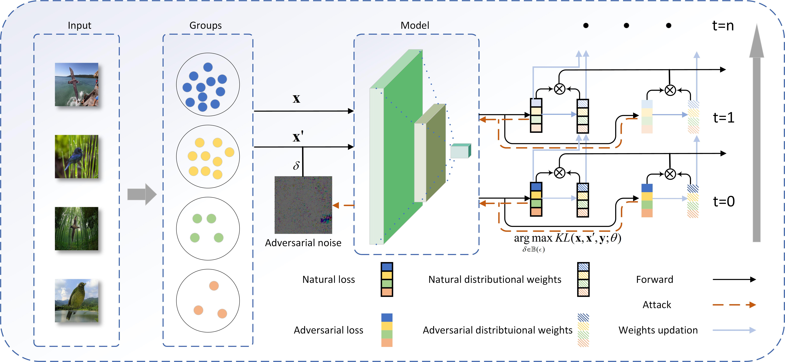

# Improving Group Robust Fairness in Subpopulation Shifts Datasets through Group Distributionally Robust Optimization
This is the official implementation of the paper "Improving Group Robust Fairness in Subpopulation Shifts Datasets through Group Distributionally Robust Optimization"


## Abstract

It is well known that adversarial training has shown promising results in defending against adversarial attacks for Deep Neural Networks (DNNs). Recently, some studies have revealed that adversarial training can introduce significant disparity in accuracy across different classes, a phenomenon known as the robust fairness problem. Furthermore, we observe that this issue is exacerbated in datasets with sub-population shifts, and simply applying existing methods does not adequately address the problem. To bridge this gap, we propose the Group Robust Fairness-Aware Learning (GRFAL) method, which enhances adversarial training by incorporating the Group Distributionally Robust Optimization (Group-DRO) framework. The key insight of our approach is to leverage regularized loss across different groups for both natural and adversarial training, from the perspective of distributionally robust optimization. Theoretically, we establish a convergence guarantee for our method, ensuring it reaches first-order stationary points in a convex setting. Empirically, we conduct experiments on two benchmark datasets and demonstrate superior performance compared to baseline methods. Additionally, we extend our study to a real-world medical application, where our method remains robust against hospital-specific spurious markers.


## Installation 
```
conda create -n myenv python=3.7
conda activate myenv
pip install -r requirements.txt
```


## Dataset
- Waterbirds: see instructions [here](https://github.com/kohpangwei/group_DRO#waterbirds).
- CelebA: see instruction [here](https://github.com/kohpangwei/group_DRO#celeba).

Waterbirds:
For running the codes, following files/folders should be in the [root_dir]/cub directory:
- `data/waterbird_complete95_forest2water2/`

CelebA:
For running the codes, following files/folders should be in the [root_dir]/celebA directory:
- `data/list_eval_partition.csv`
- `data/list_attr_celeba.csv`
- `data/img_align_celeba/`

## Training

### Waterbirds
Run the following command for Waterbirds
```
sh waterbirds.sh
```
or
```
python run_expt.py  -s confounder -d CUB -t waterbird_complete95 -c forest2water2 --lr 0.0001 --batch_size 32 --weight_decay 0.00005 --model resnet50 --n_epochs 200 --gamma 0.1 --generalization_adjustment 2 --train_type trades --log_dir_text log.txt --test_type pgd --random_init 0.0001 --epsilon 0.00196 --attack_iters 10 --lamda 1 --tau 0.01 --alpha_ 0.01 --gpu  0  --name_index robust  --log_dir 'logs'  --l2_norm 0.00 --lr_tau 0.0  --beta 6.0   --clmax 1.0  --clmin 0.0          --robust --trades_new     --train_grad  --limit_nat --limit_adv --reweight_groups 
```


### CelebA
Run the following command for CelebA
```
sh celebA.sh
```
or
```
python run_expt.py -s confounder -d CelebA -t Blond_Hair -c Male --lr 0.0001 --batch_size 32 --weight_decay 0.00005 --model resnet50 --n_epochs 50 --gamma 0.1 --generalization_adjustment 2 --train_type trades --log_dir_text log_.txt --test_type pgd --random_init 0.0001 --epsilon 0.00196 --attack_iters 10 --lamda 1 --tau 0.01 --alpha_ 0.01 --gpu 0  --name_index robust  --log_dir 'logs'  --l2_norm 0.00 --lr_tau 0.0  --beta 6.0   --clmax 1.0  --clmin 0.0    --robust --trades_new     --train_grad  --limit_nat --limit_adv --reweight_groups   
```

## Acknowledgement
This repo is built upon [Group-DRO](https://github.com/kohpangwei/group_DRO). We thank the authors for their great work.


